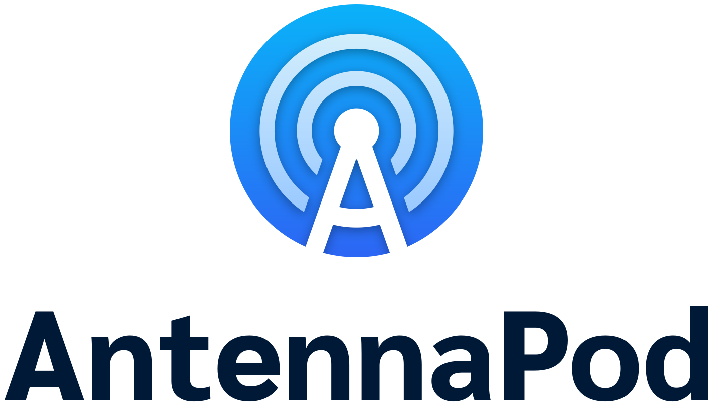

# Branding
This repository contains sources for the brand design, such as logo, screenshots and promo graphics.

### Main Logos

| Name | Preview | Variants |
|:--|:--:|:--|
| Logo |  | [png](Logo/logo-icon.png), [svg](Logo/logo-icon.png) |
| Horizontal with wordmark |  | Dark text: [png](Logo/logo-full-horizontal-dark.png), [svg](Logo/logo-full-horizontal-dark.svg)   Light text: [png](Logo/logo-full-horizontal-light.png), [svg](Logo/logo-full-horizontal-light.svg) |
| Vertical with wordmark |  | Dark text: [png](Logo/logo-full-vertical-dark.png), [svg](Logo/logo-full-vertical-dark.svg)   Light text: [png](Logo/logo-full-vertical-light.png), [svg](Logo/logo-full-vertical-light.svg) |
| Logo monochrome |  | Black: [png](Logo/logo-icon-black-out.png)   White: [png](Logo/logo-icon-white-out.png), [svg](Logo/logo-icon-white-out.png) |
| Horizontal with wordmark monochrome |  | Black: [png](Logo/logo-full-horizontal-dark.png)   White: [png](Logo/logo-full-horizontal-white-out.png), [svg](Logo/logo-full-horizontal-white-out.svg) |
| Vertical with wordmark monochrome |  | Black: [png](Logo/logo-full-vertical-dark.png)   White: [png](Logo/logo-full-vertical-white-out.png), [svg](Logo/logo-full-vertical-white-out.svg) |

### Further resources

- [Launcher icon](Launcher%20Icon)
- [Launcher icon (Development version)](Launcher%20Icon%20Dev)
- [Promo backgrounds and release announcements](Promotionals)
- [System notification icons](System%20Icon)

### Color Palette

